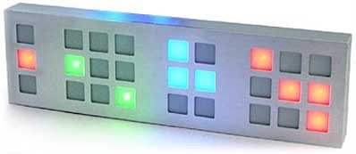
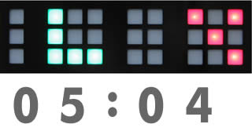
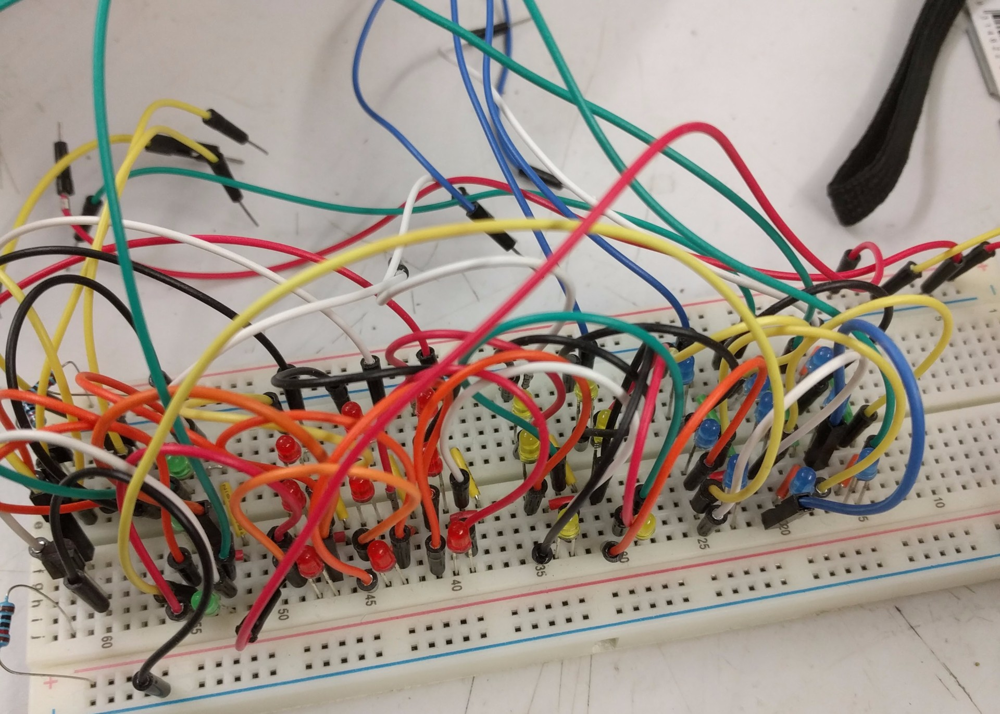
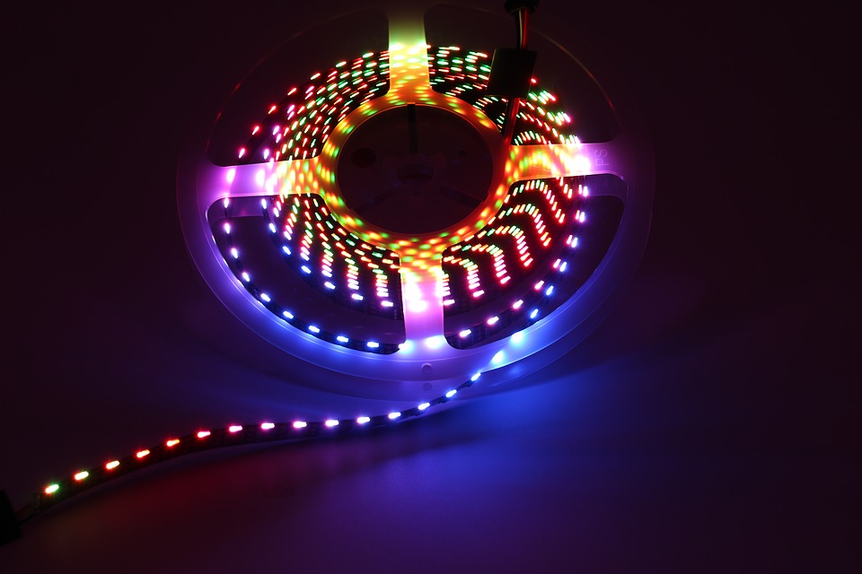
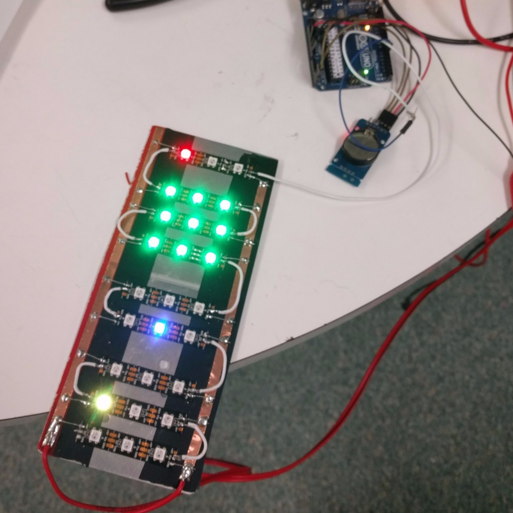
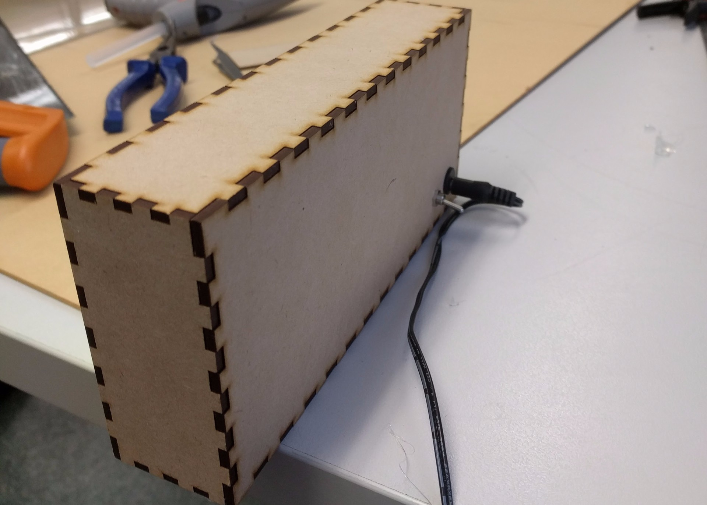

Having looked at other peoples projects of LED matrix screens, I have always wanted to make one. The only problem was that I did not have a compelling project to force me to do it until a few months ago where a mate of mine, Alex, showed me a tix clock and I was instantly hooked.

The concept is pretty simple, the clock is in 24 hour time with each section correlating to a digit. You can tell the time by counting how many lights are on in each section. The above clock is showing that it is 12:34.

There is no defined order that the lights need to be on, and to add flare you can make it change to a random pattern every few seconds to throw someone off. >:)

My first attempt....    ..... worked...

Using static colored LEDs and half a ton of jumper leads, I cobbled together a rats nest of a clock. The lot was controlled with an Arduino Uno with a RTC clock. With 27 LEDs in total, an issue occurred where there are only 14 digital pins, 12 usable and 27 LEDs. 

Fortunately because it was a matrix (3 rows, 9 columns, 12 pins) there were just enough pins to multiplex without the use of an external IC. Multiplexing is where the Arduino (or an IC) would cycle through each row, lighting one at a time, every tick. This happens at a speed that looked as though all the LEDs were a solid colour.

At this point, the next step was cleaning up the mess, and using static LEDs, the only way to do this was to get a PCB made and I procrastinated. 

Then I got addressable LEDs.

WS2812 Strip LEDs make adding colourful pretty light displays to anything a breeze. They work by one LED will take a new command, execute it (change colour) and then pass the old command to the next LED in line. This is made even easier by all the heavily supported libraries for programming with them.

One thing to keep in mind with strip LEDs is that they draw a fair bit of power, and thus generate a lot of heat. It's usually best to attach them to a surface that will disparate the heat well.

With a piece of random metal sheet as the backing heat sink, a bit of soldering and some slight edits to the original code, I had a working model which worked flawlessly.

To wrap up the project, I soldered the connections to a Arduino Pro Micro (smaller and cheaper) and used our Labs new laser cutter to fashion a nice box out of MDF and acrylic to put it all in.

Moving forward, I would like to make a PCB with everything on it, and make a few for family and friends. But for now I can call this project complete, and it looks pretty cool.

Credit to Alex for working on this project with me.