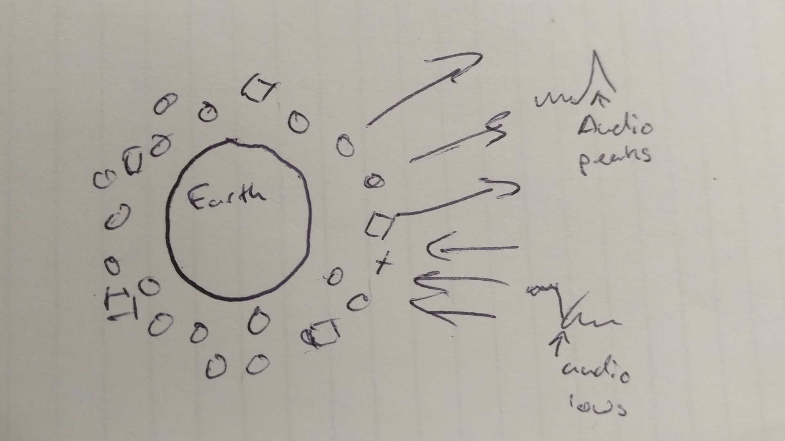
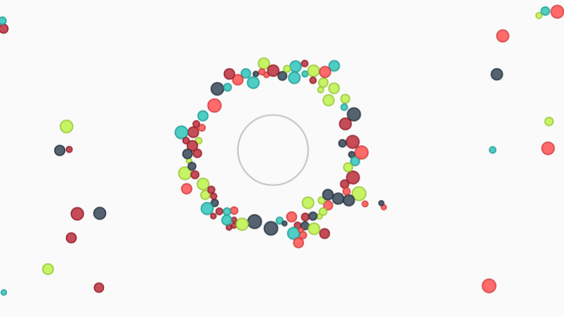

[Check out what I'm talking about.](http://dev.3mr.fr/matter/orbit.html)

Recently I've been playing around with the [Web Audio API](https://developer.mozilla.org/en-US/docs/Web/API/Web_Audio_API) more specifically using it for visualisers. 

One of the main reasons this API exists is to make visualisers for audio, but for some reason, you don't see this very much on the internet. Why is something that is beyond me, but in the mean time, I'm having fun with it.

Another API that's been around is [matter js](http://brm.io/matter-js/), a physics engine written in js for browsers. This library came up in a search (for something to populate a DOM with cats) a long time back, and I thought it was cool, but could not find a project for it.

Fast forward to a few weeks ago, I had the cool thought of having small objects falling towards a central circle, and then the music playing flinging them away. This bugged me to the point that I sat down and started to write the code.

I initially thought of writing the physics myself, but then remembered that vector acceleration, relativity and collision calculations are a headache, and quickly switched to matter where the work was already done. 

The main issue I had with the matter library was the plugins. Only three exist as far as I am aware, all depend on each other, and I needed all of them. This normally isn't an issue, but the documentation for adding them together is very vague and the implementation of the plugin system is very new, so not a lot of people have complained on their issue tracker yet. The examples they have on their website is also written in a way that's not really for coders.

After a bit of trial and error, I got the system setup, using the three plugins that added per-object gravity, and a border that will make an object disappear and reappear on the other side.

I wrote a time loop that checks the audio levels from the audio stream, calculates the average, plays around with maths, makes it negative and then redefines the centre circle's gravity. If the audio levels spike, so does the gravity and the objects go flying.

This produced a nice effect, but the objects were too sporadic, especially when the audio levels were neutral so there was no gravity pull. The solution was to add a second circle, identical to the first, but with a fixed gravity. Now the original circle pushes against the constant gravity of the other. This keeps the flying objects centralised.

Adding air friction to the flying objects also helped calm them down, especially when there were large gravity spikes, launching them at the speed of sound into one direction.

From there on, it was just a case of tweaking the calculations to try to produce a smoother finish.

The end result was a nice little one page thing that is cool to show off to people. I might in the future look at increasing it's responsiveness and giving control over the music.