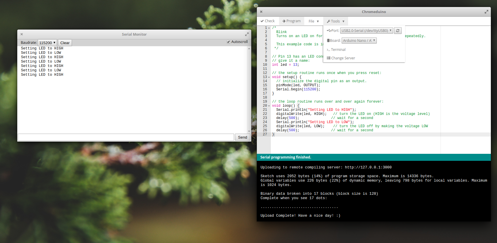
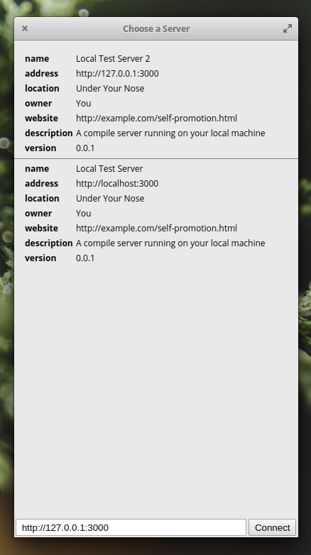

Chromeduino is a coding interface made for ChromeOS. The project was originally created by Casey Halverson (Spaceneedle) and was lacking in terms of features and stability. 
As this application is the only free option for coding Arduinos with ChromeOS, there is a need for such a tool in classrooms, where all the students have 
educational Chromebooks but the teacher/school does not have the resources to pay for the other editors.

This project involved taking the existing codebase and drastically modifying it to add in the necessary features to make the coding interface useful.
The application used a remote compiling server to translate the written code into the binaries to be flashed to the Arduinos. 
Unfortunately, the code for the original compile server was lost, so a new server also had to be created from scratch using Node.js.

The [new version of the application can be found here.](https://chrome.google.com/webstore/detail/chromeduino2/llclpgogfbmiicabgcfbndeokekmggpm?hl=en) The [GitHub can be found here.](https://github.com/spaceneedle/Chromeduino)

